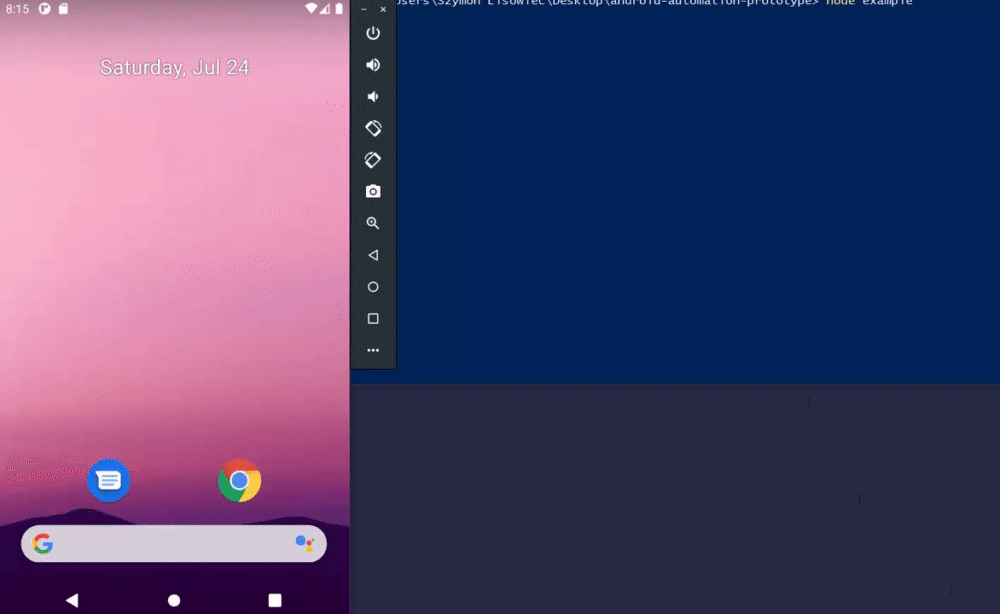

# Android Automator
[](https://npmjs.com/package/android-automator)
[](https://npmjs.com/package/android-automator)
[](https://github.com/SzymonLisowiec/android-automator/blob/master/LICENSE.MD)

__Lightweight android automation tool through adb (android debug bridge).__

# Example
```javascript
const { AndroidAutomator } = require('android-automator');

(async () => {
  const device = new AndroidAutomator();

  const batteryLevel = await device.getBatteryLevel();
  console.log(`Current battery level: ${batteryLevel}%`);
  
  // Refresh device view
  await device.refresh();
  // Swipe up to show menu
  await device.sendInput('swipe', '300 1000 300 200');
  // Tap Settings icon
  await device.tapBySelector('node[text="Settings"]');
})();
```



# Constructor
```javascript
new AndroidAutomator({
  debug: false, // `true` to display debug logs, default `false`
  logger: null, // custom logger instance, default `null` (using own logger)
  deviceSerial: 'emulator-5554', // while you have connected multiple devices, enter device serial here, default `null`
  dumpFilePath: './view.xml', // location to device view xml file, default `null`. Useful to debug what your bot see
})
```

# API

## refresh()
Refreshes device view (**required before first use `tapBySelector`**).

## adbCommand(command)
- **command** {[__String__](https://developer.mozilla.org/pl/docs/Web/JavaScript/Reference/Global_Objects/String)} - Android debug bridge command e.g. `install app.apk`, `shell`

## sendInput(type, args = null, refresh = true, source = null, displayId = null)
- **type** {[__String__](https://developer.mozilla.org/pl/docs/Web/JavaScript/Reference/Global_Objects/String)} - e.g. `text`, `keyevent`, `tap`, `swipe`, `draganddrop`, `press`, `roll`, `motionevent`
- **args** {[__String__](https://developer.mozilla.org/pl/docs/Web/JavaScript/Reference/Global_Objects/String)} - Arguments for input event, e.g. coordinates
- **refresh** {[__Boolean__](https://developer.mozilla.org/en-US/docs/Web/JavaScript/Reference/Global_Objects/Boolean)} - Set `true` to refresh device view after this event
- **source** {[__String__](https://developer.mozilla.org/pl/docs/Web/JavaScript/Reference/Global_Objects/String)} - Input event source e.g. `dpad`, `keyboard`, `mouse`, `touchpad`, `gamepad`, `touchnavigation`, `joystick`, `touchscreen`, `stylus`, `trackball`
- **displayId** {[__Number__](https://developer.mozilla.org/pl/docs/Web/JavaScript/Reference/Global_Objects/Number)} - Display id

### Examples
```javascript
await device.sendInput('tap', '100 200'); // x y
await device.sendInput('swipe', '300 1000 300 200 2000'); // x1 y1 x2 y2 duration(ms)
await device.sendInput('keyevent', 'KEYCODE_HOME'); // https://developer.android.com/reference/android/view/KeyEvent#summary
await device.sendInput('text', 'Hello'); // Text to enter
```

## tapByCords(x, y)
Alias for `device.sendInput('tap', 'x y')`

## tapBySelector(selector, strategy = 'center')
- **selector** {[__String__](https://developer.mozilla.org/pl/docs/Web/JavaScript/Reference/Global_Objects/String)} - xml selector, e.g. `node[text="Settings"]`
- **strategy** {[__String__](https://developer.mozilla.org/pl/docs/Web/JavaScript/Reference/Global_Objects/String)} - If `center`, will tap in center of selected element, if `symulate` will tap in random position of selected element relative to its center.

### getBatteryLevel()
Returns battery level as [__number__](https://developer.mozilla.org/pl/docs/Web/JavaScript/Reference/Global_Objects/Number).

# License
MIT License

Copyright (c) 2021 Szymon Lisowiec

Permission is hereby granted, free of charge, to any person obtaining a copy of this software and associated documentation files (the "Software"), to deal in the Software without restriction, including without limitation the rights to use, copy, modify, merge, publish, distribute, sublicense, and/or sell copies of the Software, and to permit persons to whom the Software is furnished to do so, subject to the following conditions:

The above copyright notice and this permission notice shall be included in all copies or substantial portions of the Software.

THE SOFTWARE IS PROVIDED "AS IS", WITHOUT WARRANTY OF ANY KIND, EXPRESS OR IMPLIED, INCLUDING BUT NOT LIMITED TO THE WARRANTIES OF MERCHANTABILITY, FITNESS FOR A PARTICULAR PURPOSE AND NONINFRINGEMENT. IN NO EVENT SHALL THE AUTHORS OR COPYRIGHT HOLDERS BE LIABLE FOR ANY CLAIM, DAMAGES OR OTHER LIABILITY, WHETHER IN AN ACTION OF CONTRACT, TORT OR OTHERWISE, ARISING FROM, OUT OF OR IN CONNECTION WITH THE SOFTWARE OR THE USE OR OTHER DEALINGS IN THE SOFTWARE.